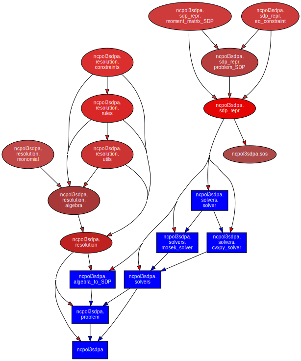
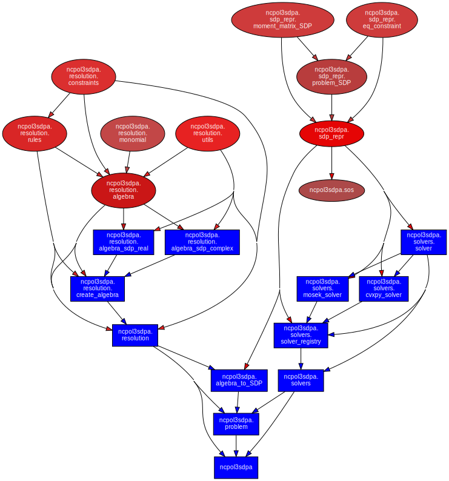

# Suivi

## 14/02/2025

- (Nazar) Setup du git
- (Nazar) Organization des sources
- (Tous) Prends en main de l'article revue (Tavakoli Pozas-Kerstjens Brown Ara\'ujo)
- (Tous) faire les exercies envoyé par l'encadrant.
- (Tous) Première prise en main avec [picos](https://picos-api.gitlab.io/picos/)
- (Nazar) essayer de faire marcher PICO avec un probleme k=2 (echeque)

## 18/02/2025

- (Mathis) implementation de la résolution du SDP niveau 2 de l'exercice 2 avec cvxpy (resultat bizarre, solution non bornée)
- (Nazar) Reproduire le resultat de Mathis que l'exo 3 n'est pas borné.
- (Yann) Résolution de l'exercice 2 à la main
- (Tous) Rendez-vous avec l'encadrant à 10h30 pour discuter de notre avancement
- (Thomas et Mathis) Résolution exercice 3 donné par l'encadrant

## 20/02/2025

- (Tous) Rendez-vous avec l'encadrant pour discuter de notre organisation et du plan
- (Tous) Premiers templates pour la structure du code

## 21/02/2025

- (Mathis)
  * implémentation des fonctions rule_of_constraint et rule_of_constraints
  * ajout de fonctions de test avec pytest

## 04/03/2025

- (Tous) RDV avec Peter Brown
- (Mathis)
  * ajout de la fonction needed_monomials + tests
- (Nazar) fonction pour generer tous les monomes
- (Yann) ajout du gestionnaire uv

## 06/03/2025
 - (Nazar) Ajouter les appels de fonction dans problem.py. ajouter fonction dictionaire dans monmial.py
 - (Mathis) ajout de la fonction create_moment_matrix + tests

## 11/03/2025
- (Nazar et Thomas) première version du solveur utilisant cvxpy
- (Mathis)
  * correction de logique dans la création des matrices de moments (changement de variable)
  * ajout de test pour le problème finale
  * aide pour le solveur
- (Yann)
  * Reformat src
  * Reformat test
  * Add mypy and ruff integration details to README
  * update pyproject.toml for mypy dependency
  * add new test for typing functionality

## 12/03/2024
- (Mathis)
  * ajout de test pour la partie solver.py
  * debug de solver.py

## 14/03/2025

- (Mathis)
  * debug de problem.py
  * ajout de la substitution dans le code général (ne marche pas mais ne créer pas d'autre bug (on peut ne pas activer les substitutions))

## 15/03/2025

- (Mathis) debug
- (Yann)
  * Clean and refactor the code
  * Add typing annotations.

## 18/03/2025

- (Mathis) debug + test
- (Yann)
  * Add sphinx to the project
  * Clean, refactor and add type annotations to the code
- (Nazar) Commencer à faire un nouvau type de données pour mieux representer des SDPs sur la branche better-sdp-representation.
- (Alain) completer funs.py + debug
- (All)
  * Meeting with Peter Brown
  * Discuss the next steps

## 23-24/03/2025
- (Nazar) Ecritre le nouvau representation du SDP. Restructuration complet du code

## 25/03/2025

- (Thomas) begin sos problem: https://www.princeton.edu/~aaa/Public/Teaching/ORF523/ORF523_Lec15.pdf ,useful link for the sos theory
- (Yann) Migrate the branch
- (Nazar) Comancer ecrire des tests pour le nouvau code
- (Alain) Commencer d'implementer l'application Max Cut
- (Mathis) Lecture et compréhension de la nouvelle implémentation du solveur

## 27/03/2025

- (Nazar) Refacturation du code. Merge un changement important

## 30/03/2025
- (Nazar) Recherche sur util pre-commit(pre-commit.com)
- (Nazar) Commencer de implementer du "property based testing" avec bibliothèque hypothesis(hypothesis.works)
- (Mathis) Apprentissage de mosek pour sa futur implémentation + apprentissage du nouveau code (surtout sur la partie solver SDP donc output de ce qui précède)

## 31/03/2025
- (Mathis) Add the mosek solver to solve the SDP, include tests with Mosek and a functionnality to choose which solver use. [A more detailed explanation of the MR can be found here](https://gitlab.telecom-paris.fr/proj104/2024-2025/python-poly-opt/-/merge_requests/4)
- (Nazar) Review the Mathis's merge_requests and sugest changes.
- (Yann)
  * Add the Mosek license for pipeline

## 01/04/2025
- (Yann)
  * Add documentation with sphinx
- (Mathis)
  * Start to implement the non commutative part of the problem
    + create a function generate_monomials_non_commutative that returns a list of all monomials of a degree less than the relaxation parameter that are non commutative
    + implement a new function apply_rule_non_commutative that is a generalisation of the function apply_rule for non commutative monomials
- (Nazar) Merge the [MR](https://gitlab.telecom-paris.fr/proj104/2024-2025/python-poly-opt/-/merge_requests/4). Add a merge request for the pre-commit tool: [!2](https://gitlab.telecom-paris.fr/proj104/2024-2025/python-poly-opt/-/merge_requests/6)
- (Alain) implemented + debug de Max cut; randomized test + [example on ncpol2sdpa](https://ncpol2sdpa.readthedocs.io/en/stable/exampleshtml.html#example-1-max-cut)
- (Thomas) learn the theory of the SOS with Peter Brown


## 02/04/2025
- (Mathis)
  * Correct apply_rule for the non commutative case
  * add tests for apply_rule

## 03/04/2025
- (Mathis)
  * Continue to implement the nc case
    + add the function degree_of_polynomial that calculate the degree of a commutative or non commutative polynomial (sympy doesn't handle the nc cases so we had to reimplement a degree function)
- (Nazar) Cogérer des erreurs de type un peut partout. Écrire un fichier interface des types pour la bibliothèque mosek(qui n'en a pas par défaut). Recherche sur max-cut et algorithme de Goemans-Williamson

## 04/04/2025
- (Mathis)
  * Continue / finish to implement the non commutative case (not working because the SDP solver can't solve the given SDp thus the issue is perhaps on the relaxation)
  * Debug the non commutative case
    + for the nc case, we have to double the relaxation_factor for the moement matrix (not the relaxation_factor in general) because if we don't extend the size of the moment matrix, we don't capture every monomials (eg: for the commutative case, x*y = y*x thus with monomials = (1, x, y) we generate x*y and y*x because x*y = y*x but for the non commutative case, we only capture x*y or y*x, so we have to extend the moment matrix to capture x*y and y*x by using more monomials (1, x, y, x**2, x*y, y*x, y**2) )
  * add a test for the non commutative case in test_problem.py
- (Nazar) Ecrire des interfaces de type pour les bibliothèque qu'on utilise et qui n'ont pas(cvxpy, sympy, mosek). Il sont dans la repertoire `src/typing_stubs`. Ourir un Merge Request liés aux types: !8.

## 05/04/2025
- (Mathis)
  * Review + Merge MR [!8](https://gitlab.telecom-paris.fr/proj104/2024-2025/python-poly-opt/-/merge_requests/8) that does :
    + Fix miscellaneous small type errors in the code
    + Remove as many # type: ignore annotations as possible
    + Write typing stubs for dependencies in src/typing_stubs. I first auto generated a template with mypy's stubgen script. Then eddied the types of functions we use in the code. The typing stubs themselves should not be typechecked
- (Alain) added functions in maxcut_example for testing efficiency of the relaxation (naive solving + bipartite graphs case)
- (Yann)
  * Read documentation about uv [link](https://docs.astral.sh/uv/concepts/projects/dependencies/#platform-specific-sources)
  * Read documentation for organize tests
  * Read documentation about pre-commit

## 08/04/2025
- (Yann)
  * Ended up to fix the branch `pydeps`
  * Try to merge
  * Read documentation
    + about pre-commit
    + about managing dependencies in uv
    + about organizing tests

- (Thomas)
  * Begin the implementation of the SOS problem by finding the solutions of the dual problem for each constraint of the primal problem with the solver cvxpy
  * Test the code: errors remain

- (Mathis)
  * Tentative de debug de l'ajout de la partie de résolution non commutative
    + finalement, il ne faut pas augmenter la taille de la moment matrix (*2) car sinon le problème n'est pas solvable
    + je ne comprends pas un point sur le papier de recherche pour l'implémentation de la partie non commutative, je vais voir avec Peter Brown pour mieux comprendre un point qui me pose problème
    + finalement, j'ai compris ce qui n'allait pas, j'ai oublié les daggers dans la formule
  * Debug (qui marche) de la partie non commutative (le problème était que je n'appliquais pas l'adjoint sur certaines variables de la moment matrix).
  * Ajout de test dans le cas d'opérateurs hermitiens

- (Nazar) Cogérer des erreurs de type un peut partout. Écrire . Recherche sur max-cut et algorithme de William Go
- (Nazar) Cogérer des erreurs de type un peut partout. Écrire un fichier interface des types pour la bibliothèque mosek(qui n'en a pas par défaut). Recherche sur max-cut et algorithme de Goemans-Williamson
  * Merge MR

- (Thomas)
 * Begin the implementation of the SOS problem by finding the solutions of the dual problem for each constraint of the primal problem with the solver cvxpy
 * test the code: errors remain

## 13/04/2025

- (Yann)
  * Read documentation about organizing tests
  * Think about the structure of the project
    + Read documentation about organizing files in a project
    + Read docs about template files / ports
- (Mathis)
  * create a [MR](https://gitlab.telecom-paris.fr/proj104/2024-2025/python-poly-opt/-/merge_requests/14) for the non commutative part, but the main was not clean so the CI/CD don't pass the MR after the merge with main (issue with mypy), need to debug it
  * add tests for the non commutative part
  * start to work on the complexe part
    + trying to understand how the complexe problems work, for which function ? (f(z, conjugate(z)) in R ?)

## 14/04/2025

- (Mathis)
  * Fix type and format errors in [MR](https://gitlab.telecom-paris.fr/proj104/2024-2025/python-poly-opt/-/merge_requests/14), (CI/CD ok)
- (Nazar) Ajouter plus de generateurs pour les structures de donnes dans tests/draw_strategies

## 15/04/2025
- (Nazar et Yann) Merge [MR Pre-Commit](https://gitlab.telecom-paris.fr/proj104/2024-2025/python-poly-opt/-/merge_requests/6)
- (Nazar) Corriger quelleque erreurs dans la configuration de pre-commit et introduire l'util au reste de l'equipe
- (Yann)
  * Merge [MR Enhencing](https://gitlab.telecom-paris.fr/proj104/2024-2025/python-poly-opt/-/merge_requests/15)
- (Mathis Yann Nazar)
  * Discussion about the structure of the project
  * Think about the use of a variable template instead of sympy variables
- (Mathis)
  * continue the implementation of the complex part
  * continue to search how to handle this case (not sure about the theory)
- (Thomas)
  * Study the link between the solutions of the dual problem and the decomposition in the SOS form

## 16/04/2025
- (Mathis)
  * continue the implementation of the complex part but it doesn't work because the matricies that represent the polynomials are not real so I sent an email to Peter Brown to have more informations about this part
  * Sent an email to Peter Brown to have a new appointment and about the progress of the project

## 19/04/2025
- (Mathis)
  * create issue(https://gitlab.telecom-paris.fr/proj104/2024-2025/python-poly-opt/-/issues/3) related to equality constraint in non commutative polynomial optimization problems.
  * Fix [#3](https://gitlab.telecom-paris.fr/proj104/2024-2025/python-poly-opt/-/issues/3) with [MR](https://gitlab.telecom-paris.fr/proj104/2024-2025/python-poly-opt/-/merge_requests/16)
    + the issue was that total_degree() doesn't handle non commutative polynomial, so I replace it with degree_of_polynomial that handle non commutative polynomial
    + The degree of relaxation was too low to capture every monomials

## 20/04/2025
- (Mathis)
  * continue to implement the complex part
    + new idea : convert the original problem into a complex SDP then convert the complex SDP into a real SDP at the end
    + start to implement the idea above
- (Yann)
  * Read some papers
    + About the context of the problem
    + About Lasserre's Hierarchy

## 3/05/2025
- (Nazar) Travail sur les test (property based testing)

## 4/05/2025
- (Nazar) ouvrir l'issue #4

## 5/05/2025

- (Alain)
  * implement gen\_bipartite\_graph + solve\_maxcut\_bipartite for examples of applications of ncpolsdpa
  * implement solve\_maxcut\_naive (works for any graph; warning if the input is large)
  * reorganized test & examples for maxcut
- (Yann & Mathis)
  * Discussion about Cros's theorem
- (Thomas, Alain, Nazar, Yann, Mathis)
  * Discuss of the social & environmental impact of the project
    + ...
  * Meeting with Peter Brown
- (Mathis)
  * Continue to try to implement the complex part
  * discussion about how to solve it with the other members
- (Nazar)
  * Discuss slow code that was found by tests
  * Merge Request to merge property-based-tests branch: !17
  * Review MR de Yann sur la restructuration de code
- (Yann)
  * Think about the [MR 18](https://gitlab.telecom-paris.fr/proj104/2024-2025/python-poly-opt/-/merge_requests/18) about restructuration of the code
  * Close the MR 18 because the restructuration of the code is not finished
- (Thomas & Nazar) Discousion de comment implementer la decomposition SOS

## 6/05/2025
- (Nazar)
  + Open some isues #5, #6
  + Fix a bug in the test that caused them to take too long
  + Open the sos-decomposition branch in preparation to rewrite of the the SOS part. Discuss organisation of upcoming work with Thomas
  + Discuss failing tests in !17 with Mathis
- (Mathis)
  + Adapt the functions to handle hermitian matrices for the complex part instead of the symmetric matrices

## 08/05/2025
- (Mathis)
  + Change the function that generate monomials for the complex part. We no longer generate the conjugate of the variables because this create issue when we create hermitian matrices instead of symmetric matrices for the complex part
- (Alain) change 'check-larger-files settings' for pre-commit package

## 11/05/2025
- (Mathis)
  + Finish the implementation of the complexSDP to realSDP.
    * the tests pass but we need to do more tests on this function
    * The implementation of the different elements is messy, we will need to clean the code

## 12/05/2025
- (Yann)
  * Works on the MR 18 and projects structure
  * Works on the social and environmental impact of the project
  * New architecture :
```
ncpol3sdpa
├─ __init__.py
├─ problem.py
├─ sos.py
├─ sdp_repr               The structure of a problem
│  ├─ __init__.py         ProblemSDP, EqConstraint, MomentMatrixSDP
│  ├─ MomentMatrixSDP
│  ├─ ProblemSDP
│  └─ EqConstraint
├─ resolution             The resolution of a problem
│  ├─ __init__.py         Rule, apply_rule_to_polynomial, Constraint
│  ├─ rules.py
│  ├─ apply_rules.py
│  ├─ constraints.py
│  ├─ monomial.py
│  └─ algebra.py          AlgebraSDP,
├─ solvers                Implementation of the solvers
│  ├─ __init__.py
│  ├─ cvxpy_solver.py
│  └─ mosek_solver.py
└─ solver.py              Solver
```
- (Alain)
  * adds bibliography about other implementable examples
  * continues the implementation of examples + tests on graph algorithms
  * implement a class for MobFarm optimization
  * thinking about raising issue to allow returning approximative values reaching near the optimum

- (Thomas et Nazar)
  * implmentation of the sos, it remains the tests to make
- (Mathis)
  * debugging the optimization for complex polynomials
  * add tests for the complex part
  * create a [MR](https://gitlab.telecom-paris.fr/proj104/2024-2025/python-poly-opt/-/merge_requests/20) for the complex polynomials optimization

## 13/05/2025
- (Yann)
  * Finish the [MR 22](https://gitlab.telecom-paris.fr/proj104/2024-2025/python-poly-opt/-/merge_requests/22) about the project structure




- (Mathis)
  * Creation of two classes `AlgebraSDPReal` and `AlgebraSDPComplex` to properly handle the real and complex cases with the polymorphism of the OOP. These changes lead to the [MR](https://gitlab.telecom-paris.fr/proj104/2024-2025/python-poly-opt/-/merge_requests/24)

## 14/05/2025
- (Yann)
  * Work on the `AlgebraSDPReal` and `AlgebraSDPComplex` classes
  * Improve the project structure
  * Merge the [MR 24](https://gitlab.telecom-paris.fr/proj104/2024-2025/python-poly-opt/-/merge_requests/24) about the project structure




# 16/05/2025
- (Mathis)
  * Work on the theory of the optimization of complex non commutative problems. I'm trying to find out what these problems are because the value of the objective must be real.

# 18/05/2025
- (Nazar) Redo the property based testing Merge Request because the Yann's reorganization broke everything
- (Yann)
  * Work on audit presentation

# 19/05/2025
- (Nazar) Implement getting the full solution from the mosek solver from the SOS decomposition
- (Nazar & Mathis) Work out the details on how to force the A matrix to be hermitian in the non-commutative case
- (Everyone) Present project during audit
- (Yann)
  * Documentation Infrastructure:
    + Created and updated Sphinx documentation setup
    + Added script (generate_docs.py) to automatically generate RST documentation files
    + Updated configuration in conf.py for proper documentation generation
    + Configured the sphinx-rtd-theme for better documentation presentation
  * Documentation Content:
    + Created core documentation files: API reference, examples, quickstart guide, and overview
    + Added mathematical descriptions of the optimization problems the library tackles
    + Included example code demonstrating basic usage
  * Project Organization:
    + Added and updated .gitignore files to properly manage generated documentation files
    + Restructured module documentation paths to use a "generated/" subdirectory
    + Removed unused toctree entries from documentation
  * Library Description:
    + Updated description of the ncpol3sdpa library, which is described as a successor to ncpol2sdpa
    + Added mathematical notation for the optimization problems being solved
    + Noted that the package is still under development and not yet fully functional
 - (Alain) add comments on the examples branch + reorganized files

# 20/05/2025
- (Yann)
  * Documentation Updates:
    + New .gitignore for documentation build artifacts
    + Moved HTML .gitignore to build directory
    + Added .gitignore for generated files
  * Documentation Structure:
    + Removed unused toctree entries from ncpol3sdpa documentation
    + Updated API reference file paths in source files
    + Updated documentation generation script to match new structure
- (Mathis)
  * Refactor the nc part by creating a new class `AlgebraSDPnc` that inheritate from `AlgebraSDP` [MR26](https://gitlab.telecom-paris.fr/proj104/2024-2025/python-poly-opt/-/merge_requests/26/diffs)

# 21/05/2025
- (Yann)
  * Works on [MR 25](https://gitlab.telecom-paris.fr/proj104/2024-2025/python-poly-opt/-/merge_requests/25) and [MR 26](https://gitlab.telecom-paris.fr/proj104/2024-2025/python-poly-opt/-/merge_requests/26)
- (Nazar) Work on fixing issue #6 . Uscucseffuly try to implement #8 . Read Boaz's notes on SOS
- (Mathis) Start the implementation of the nc-complex part by creating `AlgebraSDPncReal` and `AlgebraSDPncComplex` to properly implement the complex case without changing the real part (that is faster)

# 22/05/2025
- (Nazar) Test the fix for issue #6. Open a merge request for this issue
- (Mathis)
  * Finish the implementation if the nc-complex part
    + in the generation of the monomials, I added the adjoint of the symbols that were not hermitian in the nc part
    + Modified the test_monomials.py file to make the change on `generale_monomials` work.
    + Finished the implementation of `AlgebraSDPncReal` and `AlgebraSDPncComplex`
    + Created tests for the nc-complex part
    + Created the [MR 28](https://gitlab.telecom-paris.fr/proj104/2024-2025/python-poly-opt/-/merge_requests/28) that implements all the nc-complex part

# 25/05/2025
 - (Nazar)
    * Write a document explainig the math of the SOS decomposition, and the SDP duality.
    * Begin refactoring of SDP code.
 - (Alain) begin work on integrating more extended applications (e.g applications of MaxCut relaxation, etc) on branch examples

# 26/05/2025
- (Mathis)
  * Review + Merge [MR](https://gitlab.telecom-paris.fr/proj104/2024-2025/python-poly-opt/-/merge_requests/27)
  * Raise some issues :  [13](https://gitlab.telecom-paris.fr/proj104/2024-2025/python-poly-opt/-/issues/13) [14](https://gitlab.telecom-paris.fr/proj104/2024-2025/python-poly-opt/-/issues/14)
  * start to replace the matrices by sparse matrices to have better performance
- (Yann)
  * Create the [MR 29](https://gitlab.telecom-paris.fr/proj104/2024-2025/python-poly-opt/-/merge_requests/29)
    + Added a new `ConstraintType` enum with three constraint type : `EQUALITY`, `INEQUALITY` and `LOCAL_INEQUALITY`
    + Modified the `Constraint` class to use this enum instead of a boolean flag

-(Nazar and Thomas)
 * Modification of the class sos
 * Continue the tests of this class

# 27/05/2025
 - (Mathis)
  * Finish the replacement of arrays by sparse matrices.
  * Create an MR for the sparse matrices [MR](https://gitlab.telecom-paris.fr/proj104/2024-2025/python-poly-opt/-/merge_requests/30)

# 28/05/2025
 - (Nazar) Fix 2 bugs in the SOS decomposition
 - (Yann) Works on Gitlab Pages setup for the documentation

# 29/05/2025
 - (Nazar) Refactor rules API, MR !31
 - (Mathis) Review this MR
 - (Alain) work on minor fixes for Git documentation (typos in README)

# 30/05/2025
 - (Nazar) Add more test to !31
 - (Mathis) New review of !31 (some tests does not pass but they are niche)

# 31/05/2025
 - (Nazar) Add equality constraint support for the SOS decomposition

# 01/06/2025
 - (Nazar) Add property based tests to the SOS decomposition
 - (Alain) add example_code for MobFarm

# 01/06/2025
 - (Nazar) Add more tests to the SOS decomposition, and fix bugs.

# 02/06/2025
 - (Thomas) Begin the work on one possible application of the sdp relaxation: the quantum gorund-state problem
 - (All) Meeting with Peter Brown
 - (Matihs) Begin to implement the trace inequality constraint
 - (Yann) Work on the pipeline
    * Add code coverage to the pipeline
    * Test to add code quality
    * Add code coverage visualization

New planning for the folowing 2 weeks:
  Thomas : Ground State Energy example
  Mathis : trance inequality, petentioly tensor product
  Alain : Bell inequality example
  Nazar : SOS support for Comlex solution, SOS support for trance inequality
  Yann : Finish implementing the Documentaion. Profiling for the test to see why they take so long

# 03/06/25
 - (Alain) begin work on displaying optimized mob farms, on branch of examples

# 05/06/2025
 - (Mathis)
  * Finish the implementation of the trace inequality constraint -> create a [MR](https://gitlab.telecom-paris.fr/proj104/2024-2025/python-poly-opt/-/merge_requests/33)
 - (Nazar) Review this merge requestst [MR](https://gitlab.telecom-paris.fr/proj104/2024-2025/python-poly-opt/-/merge_requests/33)

 # 21/06/2025
 - (Mathis)
  * Search about the tensor product optimization (how does it work)

# 22/06/2025
- (Mathis)
  * Change MR [33] to implement the requested changes
  * Change MR [33] to implement the requested changes

# 23/06/2025
- (Thomas)
  * Continue the work on goround-state and mthen modifie the approche after the meeting with Peter Brown
- (Nazar)
  * Aprove [Merge Request](https://gitlab.telecom-paris.fr/proj104/2024-2025/python-poly-opt/-/merge_requests/33) for the local inequality constaints
  * Fix bug in generate_needed_symbols
  * Add randomized propery tests for SOS
  * Add type paramerter for Solution_SDP (real/complex)
  * Begin work to convert a real solution of an SDP to a complex solution
- (Mathis & Nazar) Discover big problem in the way the complex SDP was handled. Argumets + tring to understand the problem.
- (Alain)
  * debug mob farm optimization
  * add repr for mob farm & constraints
- (Yann) 
  * Work on coverage documentation to create a coverage html report
  * Merge [MR 32 — GitLab Page configuration](https://gitlab.telecom-paris.fr/proj104/2024-2025/python-poly-opt/-/merge_requests/32)
  * Merge [MR 34 — Documentation Improvements](https://gitlab.telecom-paris.fr/proj104/2024-2025/python-poly-opt/-/merge_requests/34)
  * Merge [MR 35 — Documentation and Configuration Improvements](https://gitlab.telecom-paris.fr/proj104/2024-2025/python-poly-opt/-/merge_requests/35)
  * Merge [MR 36 - Github action](https://gitlab.telecom-paris.fr/proj104/2024-2025/python-poly-opt/-/merge_requests/36)
- (All)
  * Email to Peter Brown to ask questions
  * Think about the documentation

# 24/06/2025
- (Thomas)
  * Finish the implementation of the ground-state problem and a set of examples to test
- (Mathis & Nazar)
  * Big problem solved. Previusly, constraints in the complex SDP between maricies would only constrain the real parts of the coeffients, so additional constraints were required for the imaginary part.
- (Nazar)
  * Implement support local inequality constraint in SOS
  * Implement with the help of Mathis the solution to the previeus problem, by adding additional constraints on the imaginary parts.
  * Refactor complex SDP to real SDP conversion
  * add scipy type stubs
  * Add articles to the bibliography at Yann's request
- (Yann)
  * Merge [MR 38 - Refactor & clean documentation](https://gitlab.telecom-paris.fr/proj104/2024-2025/python-poly-opt/-/merge_requests/38)
  * Merge [MR 39 - Improve docstrings](https://gitlab.telecom-paris.fr/proj104/2024-2025/python-poly-opt/-/merge_requests/39)
  * Create a todo list for the next steps in the project

# 25/06/2025
- (Nazar)
  * Add tests and fix bugs for the complex non commutative case for the SOS decomposition
  * Tweek misconfigured tests that was causing failure because of long execution time and floating point precision errors.
- (Alain)
  * debug in MobFarm with Nazar -> fix algebra.py + merge generate_needed_symbols
- (Yann)
  * Merge [MR 41 — Update GitHub Workflows & Documentation](https://gitlab.telecom-paris.fr/proj104/2024-2025/python-poly-opt/-/merge_requests/41)
  * Merge [MR 44 — Refactor solver architecture and make MOSEK optional dependency](https://gitlab.telecom-paris.fr/proj104/2024-2025/python-poly-opt/-/merge_requests/44)
  * Merge [MR 47 — Solver enhancements](https://gitlab.telecom-paris.fr/proj104/2024-2025/python-poly-opt/-/merge_requests/47)