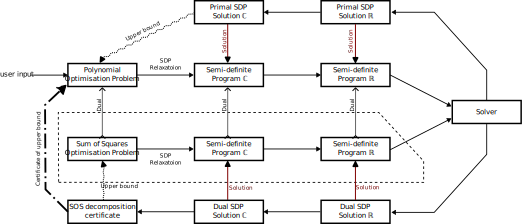

Basics
===========

Inputting your problem
---------------------

`ncpol3sdpa` can take a wide range of polynomial optimization problems that have a certain form. It supports
commutative and noncommutative problem, as well as real and complex problems. The format of the problem is
slightly different depending on the former parameters. To specify what kind of problem you want to solve, there
are options for `Problem` class: `is_real` and `is_commutative`. They default to the real and commutative problem.

.. code-block:: python

    # Example: a complex non-commutative problem
    prob2 = Problem(c, is_real=False, is_commutative=False)

Real Commutative
~~~~~~~~~~~~~~~~

Here is the mathematical form of the real commutative problems supported by `ncpol3sdpa` :

.. math::
    \large \begin{gather*}
    & \max_{X_1, \cdots , X_n \in \mathbb R} & c(X_1, \cdots , X_n) \\
    & \textrm{s.t.} & f_i(X_1, \cdots , X_n) = 0            & \forall i\\
    &               & g_i(X_1, \cdots , X_n) \geqslant 0    & \forall i\\
    \end{gather*}

Where the problem specific parameters are:

    * :math:`c` is the objective polynomial
    * :math:`(f_i)` are equality constraint polynomials
    * :math:`(g_i)` are inequality constraint polynomials

The objective polynomial is specified when creating the problem:

.. code-block:: python

    problem = Problem(c)

Constraints can be added in the following way:

.. code-block:: python

    # Equality constraints
    problem.add_constraint(Constraint.EqualityConstraint(f_i))
    # Inequality constraints
    problem.add_constraint(Constraint.InequalityConstraint(g_i))

Complex noncommutative
~~~~~~~~~~~~~~~~~~~~~~

In the complex non-commutative case, the problem optimises over all Hilbert spaces :math:`\mathcal H` and
all linear operators :math:`X_1, \cdots , X_n \in \mathcal L (\mathcal H)`. There is also an implicit state
vector :math:`v \in \mathcal H`.

.. math::
    \large \begin{gather*}
    &\max_{\mathcal H, v, X_1, \cdots , X_n} & v^\dagger c(X_1, \cdots , X_n) v \\
    & \textrm{s.t.} & f_i(X_1, \cdots , X_n) = 0 & \forall i\\
    & & g_i(X_1, \cdots , X_n) \succcurlyeq 0 & \forall i\\
    & & v^\dagger h_i(X_1, \cdots , X_n) v \geqslant 0 & \forall i\\
    & & \lVert v \rVert = 1 &
    \end{gather*}

Where the problem specific parameters are:

    * :math:`c` is the objective polynomial. It must be hermitian.
    * :math:`(f_i)` are equality constraint polynomials
    * :math:`(g_i)` are inequality constraint polynomials. They also must be hermitian.
    * :math:`(h_i)` are trace inequality constraint polynomials, which is a weaker version and faster version of inequality constraints. They also must be hermitian.

As previusly, constraints can be added in the following way:

Constraints can be added in the following way:

.. code-block:: python

    # Equality constraints
    problem.add_constraint(Constraint.EqualityConstraint(f_i))
    # Inequality constraints
    problem.add_constraint(Constraint.InequalityConstraint(g_i))
    # Trace inequality constraints
    problem.add_constraint(Constraint.InequalityConstraint(h_i))

This is also equivalent to the following formulation, with :math:`\rho = v v^\dagger` :

.. math::
    \large \begin{gather*}
    &\max_{\mathcal H, \rho, X_1, \cdots , X_n} & \mathrm{tr} \left(\rho \, c(X_1, \cdots , X_n)\right) \\
    & \textrm{s.t.} & f_i(X_1, \cdots , X_n) = 0 & \forall i\\
    & & g_i(X_1, \cdots , X_n) \succcurlyeq 0 & \forall i\\
    & & \mathrm{tr}(\rho h_i(X_1, \cdots , X_n)) \geqslant 0 & \forall i\\
    & & \mathrm{tr}(\rho) = 1, \rho \succcurlyeq 0 &
    \end{gather*}

If you have equality constraints of the form :math:`M = N`, where both :math:`M` and :math:`N` are
both monomials, then it is possible to encode it as a substitution rule :math:`M \rightarrow N`,
which can be faster than a regular constraint. This is done like this:

.. code-block:: python

    problem.add_rule(M, N)

.. warning::
    Caution should be taken so as to not introduce an infinite chain of substitutions, in which case
    the program will not terminate. A simple way to achieve this is to make sure that the degree of
    :math:`M` is strictly greater then the degree of :math:`N`. Or more generally that
    :math:`M \succcurlyeq N`  for some well founded relation  :math:`\succcurlyeq`.

    Example:  :math:`X \rightarrow Y^2`, :math:`XY \rightarrow X^2`, this goes to make the infinite
    chain of substitutions :math:`X^2 \rightarrow X Y^2 \rightarrow X^2Y\rightarrow X^2Y^3 \rightarrow \cdots`

Solving the problem
-------------------

Once A problem has been set up, the following function will create an SDP relaxation of
order :math:`k` and call a solver.

.. code-block:: python

    s = problem.solve(k)

.. warning::
    `s` is an upper bound for the orignal problem, and not the true solution. As :math:`k \rightarrow \infty`,
    :math:`s_k` is approaches the solution of the original problem, at the cost of more computation time.

A specific solver can be specified as follows, one of :doc:`api/SolverFactory/SolverList`

.. code-block:: python

    # Solve with Mosek
    s = problem.solve(k, SolverList.MOSEK)

Exploiting the solution
-----------------------

Once `problem.solve` has been called, there are several options for exploiting the solution.

Primal and Dual solutions
~~~~~~~~~~~~~~~~~~~~~~~~~

The solvers produce a primal and a dual solution to the SDP relaxation. The objective values of these solution can be accessed like this:

.. code-block:: python

    problem.solution.primal_objective_value
    problem.solution.dual_objective_value

Both are upper bounds to the original polynomial problem.

In general problem.solution contains most of the raw solution data from the solver, including
the numerical value of the moment matrices, see doc:`api/SDP_Solution`

SOS Decomposition
~~~~~~~~~~~~~~~~~

The solution can also be transformed into the SOS decomposition certificate that the dual objective value is a proof.

.. code-block:: python

    sos = problem.compute_sos_decomposition()

For more information, see :docs:`sos_guide` and :docs:`api/Sos`

Inner workings of ncpol3sdpa
----------------------------

