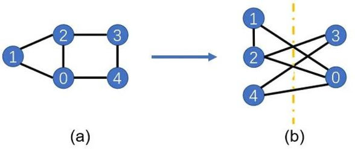
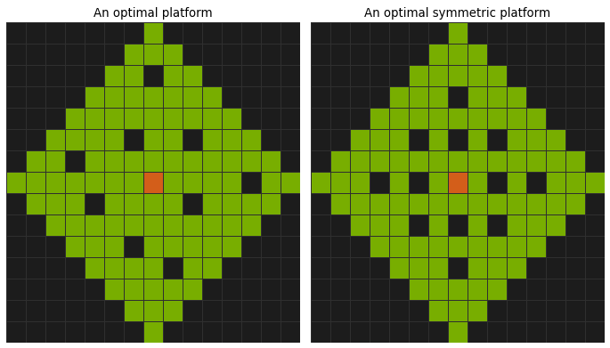

Examples
========

Example 1: Simple Polynomial Optimization
-----------------------------------------

Here's a simple example to get you started:

.. math::

   \begin{align}
   \max_{x, y} &\quad\quad x \cdot y\\
   \text{s.t.} &\quad\quad x^2 - x &= 0 \\
               &\quad\quad -y^2 + y + 0.25 &\geq 0
   \end{align}

.. code-block:: python

   from ncpol3sdpa import Problem, Constraint, SolverList
   from sympy.abc import x, y

   # Define objective function
   objective = x*y

   # Create problem
   problem = Problem(obj, is_real=True)

   # Add constraints
   c1 = Constraint.EqualityConstraint(x * x - x)
   c2 = Constraint.InequalityConstraint(-y * y + y + 0.25)
   problem.add_constraint(c1)
   problem.add_constraint(c2)

   # Solve the problem (default solver is CVXPY)
   result = problem.solve(relaxation_order=2)
   print(f"Optimal value: {result}")

   # Select a particular solver
   print(f"CVXPY : {problem.solve(relaxation_order=2, solver=SolverList.CVXPY)}")
   print(f"MOSEK : {problem.solve(relaxation_order=2, solver=SolverList.MOSEK)}")

Example 2: Non-commutative Complex Polynomial Optimization
----------------------------------------------------------

This example demonstrates how to solve a non-commutative complex polynomial optimization problem.

.. code-block:: python

   from ncpol3sdpa import Problem, Constraint
   from sympy.physics.quantum import HermitianOperator

   a = HermitianOperator("a")
   b = HermitianOperator("b")

   obj = a ** 2 - 0.5 * a * b - 0.5 * b * a - a.adjoint()

   p = Problem(obj, is_commutative=False, is_real=False)

   c1 = Constraint.InequalityConstraint(a - a**2)
   c2 = Constraint.InequalityConstraint(b - b**2)
   p.add_constraint(c1)
   p.add_constraint(c2)

   print(f"Optimal value: {p.solve(relaxation_order=2)}")

.. Example X: Max-Cut Problem
.. --------------------------

.. This example shows how to solve a Max-Cut problem using ncpol3sdpa.

.. .. code-block:: python

..    # Example code for Max-Cut will be provided here

.. For more information about Max-Cut, see the :doc:`api/max_cut` section.

Example 3: Sum-of-Squares (SOS) Optimization
--------------------------------------------

This example shows how to obtain a basic Sum-of-Squares decomposition certificate (SOS) for a problem.
Consider the following problem:

.. math::

   \begin{align}
   \max_{x, y} &\quad\quad  4 x y -(x + y)^2 \\
   \end{align}

.. code-block:: python

   from ncpol3sdpa import Problem, Constraint
   from sympy.abc import x, y
   import sympy

   # Define objective function
   objective = -sympy.expand((x + y)**2 - 4* x * y)

   # Create problem
   problem = Problem(obj, is_real=True)

   # Solve the problem (default solver is CVXPY)
   result = problem.solve()
   print(f"Optimal value: {result.dual_objective_value}")

   # Extract SOS decomposition
   sos = problem.compute_sos_decomposition()

   # This is a sum of squares decomposition of the objective, proving that objective <= result.dual_objective_value
   obj_decomposition = sos.reconstructed_objective()
   print(obj_decomposition)

   # Because of floating-point rounding errors, there is a difference between the objective and the decomposition
   # the following function mesures this error:
   error = sos.objective_error()
   print("sos error=", error)

In this case, result.dual_objective_value is 0, so we prove that :math:`(x + y)^2 \geq 4 x y`, proving the AM-GM inequality.

This example is without constraints. With each constraint that is added, there are additional
terms that appear in the SOS decomposition.

For more information about SOS, see the :doc:`sos` and :doc:`api/SOS` section.

Example 4: CHSH Bell inequality
----------------------------------------------------------

This example demonstrates how to express and optimize the **CHSH Bell inequality**
using non-commutative polynomial optimization with `ncpol3sdpa`.

Overview
^^^^^^^^

We consider two parties, Alice and Bob, each with two measurement settings:

- Alice: :math:`A_0`, :math:`A_1`
- Bob: :math:`B_0`, :math:`B_1`

The CHSH expression is:

.. math::

    \langle A_0 B_0 \rangle + \langle A_0 B_1 \rangle + \langle A_1 B_0 \rangle - \langle A_1 B_1 \rangle \leq 2

In quantum mechanics, this value can reach up to :math:`2\sqrt{2} \approx 2.828`, violating the classical (local hidden variable) bound of 2.

Code Example
^^^^^^^^^^^^

.. code-block:: python

    A0 = HermitianOperator("A0")
    A1 = HermitianOperator("A1")
    B0 = HermitianOperator("B0")
    B1 = HermitianOperator("B1")
    obj = A0 * B0 + A0 * B1 + A1 * B0 - A1 * B1
    p = Problem(
        obj, is_commutative=False, is_real=False, commute_variables=[[A0, A1], [B0, B1]]
    )
    p.add_constraint(Constraint.EqualityConstraint(A0 * A0 - 1))
    p.add_constraint(Constraint.EqualityConstraint(A1 * A1 - 1))
    p.add_constraint(Constraint.EqualityConstraint(B0 * B0 - 1))
    p.add_constraint(Constraint.EqualityConstraint(B1 * B1 - 1))

    print(f"Optimal value: {p.solve(relaxation_order=1, solver=ListSolver.MOSEK)}")
    # print 2.828

Example 5: Ground State Problem
-------------------------------

The ground state problem is a fundamental issue in quantum mechanics and quantum computing, where the goal is to find the lowest energy state (ground state) of a quantum system.

Mathematically, the ground state problem can be formulated as follows:

.. math::

   \begin{align}
   \min_{\psi} &\quad\quad \langle \psi | \hat H | \psi \rangle \\
   \text{s.t. } &\quad\quad \langle \psi | \psi \rangle = 1
   \end{align}

where :math:`\hat H` is the Hamiltonian operator of the system, and :math:`|\psi\rangle` is the state vector of the quantum system.

Specifically, we solve this problem for a system with multiple particles interacting with their neighbors. The Hamiltonian is given by:

.. math::

   \begin{align}
   \hat H &= \sum \hat H_{i,j} \\
   \hat H_{i,j} &= - X_i \otimes X_j - Y_i \otimes Y_j - Z_i \otimes Z_j
   \end{align}

where :math:`H_{i,j}` is the interaction term between particles :math:`i` and :math:`j`, and :math:`X`, :math:`Y`, and :math:`Z` are position operators (Pauli matrices).

.. Example X: BB84 Quantum Key Distribution
.. -----------------------------------------

.. This example demonstrates how to implement the BB84 quantum key distribution protocol.

.. .. code-block:: python

..    # Example code for BB84 will be provided here

Example 6: Max-Cut
------------------

The Max-Cut problem is a well-known combinatorial optimization problem where the goal is to partition the vertices of a graph into two disjoint subsets such that the number of edges between the subsets is maximized.

Mathematically, given a graph with vertices :math:`V` and edges :math:`E`, the Max-Cut problem is to find a partition of the vertices into two sets :math:`S_1` and :math:`S_2`:

.. math::

   \begin{align}
   \max_{S_1, S_2} &\quad\quad
   \sum_{(u, v) \in E} \mathbb{1}_{(u \in S_1, v \in S_2) \text{ or } (u \in S_2, v \in S_1)} \\
   \text{ s.t. } &\quad\quad S_1 \cap S_2 = \emptyset, \\
       &\quad\quad S_1 \cup S_2 = V
   \end{align}

where :math:`\mathbb{1}` is the indicator function.

Example 7: Minecraft Mob Farm
-----------------------------

The goal is to maximize the free space with the constraint that there is no 3x3 square of free space.

We can model this problem as a polynomial optimization problem: each square is a variable that can be either free (1) or occupied (0), and the constraints ensure that no 3x3 square of free space exists. We can also add the symmetric constraints to ensure that the solution is symmetric.

.. .. toctree::
   :maxdepth: 2
   :caption: Contents
